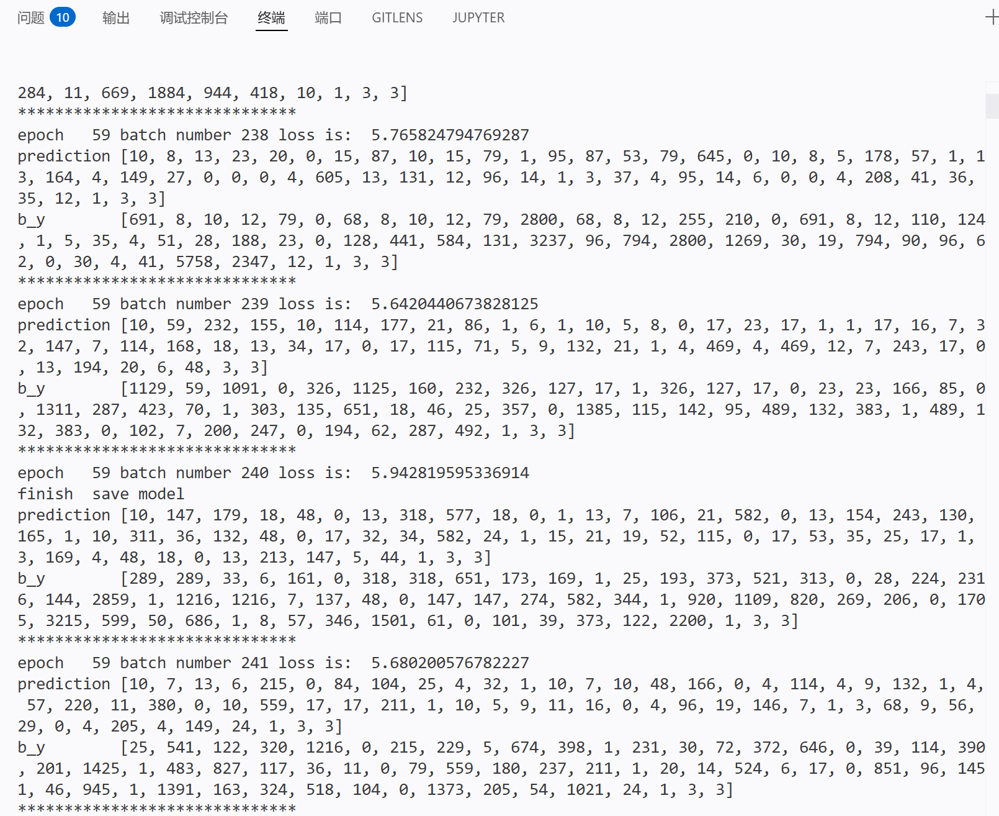
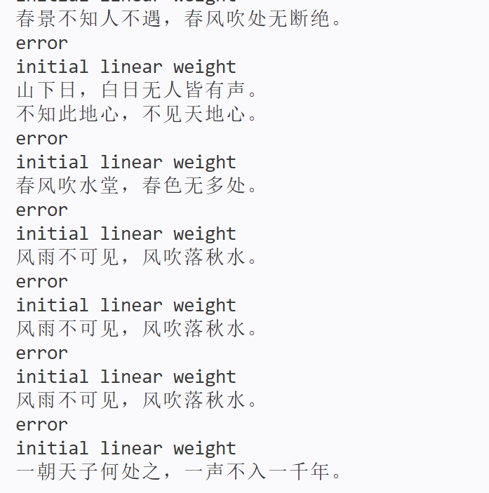

# 深度学习课程实验报告：基于RNN的古诗生成模型

---

## 一、实验目的

本实验旨在通过实现循环神经网络（RNN）模型，学习序列数据建模方法，并应用于中文古诗生成任务。通过构建基于LSTM的语言模型，使模型能够学习诗歌的语言结构和语义规律，从而生成具有一定文学特征的诗句。

---

## 二、模型与代码实现

### 2.1 补全后的核心模型代码

```python
self.rnn_lstm = nn.LSTM(
    input_size=embedding_dim,
    hidden_size=lstm_hidden_dim,
    num_layers=2,
    batch_first=True
)
```

```python
h0 = torch.zeros(2, 1, self.lstm_dim)
c0 = torch.zeros(2, 1, self.lstm_dim)

output, _ = self.rnn_lstm(batch_input, (h0, c0))
```

```python
out = self.fc(out)
out = self.softmax(out)
```

---

### 2.2 模型结构说明

整体模型结构如下：

```
输入（字索引）
   ↓
Embedding层
   ↓
LSTM（2层）
   ↓
全连接层（Linear）
   ↓
Softmax
   ↓
输出（下一个字概率）
```

---

## 三、理论基础

### 3.1 RNN（循环神经网络）

RNN是一类用于处理序列数据的神经网络，其特点是：

* 具有“记忆能力”
* 当前输出依赖历史信息

基本公式：

$$
h_t = f(W_h h_{t-1} + W_x x_t)
$$
问题：

* 梯度消失 / 梯度爆炸
* 长距离依赖难以学习

---

### 3.2 LSTM（长短期记忆网络）

LSTM是RNN的改进版本，引入“门控机制”：

#### 核心结构：

* 遗忘门（Forget Gate）
* 输入门（Input Gate）
* 输出门（Output Gate）

#### 关键公式：

$$
f_t = \sigma(W_f [h_{t-1}, x_t])
$$

$$
i_t = \sigma(W_i [h_{t-1}, x_t])
$$

$$
C_t = f_t * C_{t-1} + i_t * \tilde{C}_t
$$

优点：

* 解决梯度消失问题
* 能捕捉长距离依赖

---

### 3.3 GRU（门控循环单元）

GRU是LSTM的简化版本：

#### 特点：

* 只有两个门：

  * 更新门
  * 重置门
* 结构更简单，训练更快

#### 对比：

| 模型   | 参数量 | 表达能力 | 训练速度 |
| ---- | --- | ---- | ---- |
| RNN  | 少   | 弱    | 快    |
| LSTM | 多   | 强    | 较慢   |
| GRU  | 中   | 较强   | 较快   |

---

## 四、诗歌生成过程

### 4.1 数据预处理

数据来源：`poems.txt`

处理流程：

1. 读取诗句
2. 去除特殊字符
3. 添加起始符号 `G` 和结束符号 `E`
4. 构建词表（word_to_int）
5. 转换为数字序列

示例：

```
原句：春眠不觉晓
处理后：G春眠不觉晓E
编码后：[12, 45, 33, ...]
```

---

### 4.2 模型训练过程

训练流程：

1. 输入序列 X
2. 目标序列 Y（右移一位）

示例：

```
X: 春 眠 不 觉 晓
Y: 眠 不 觉 晓 晓
```

3. 前向传播
4. 计算损失（NLLLoss）
5. 反向传播
6. 参数更新（RMSprop）

---

### 4.3 诗歌生成过程

生成流程：

1. 输入起始字（如“日”）
2. 模型预测下一个字
3. 将预测字加入序列
4. 重复直到结束符或长度限制

示例：

```
输入：日
输出：日照香炉生紫烟...
```

---

## 五、实验结果分析

### 5.1 损失变化

训练结果：

```
初始 loss ≈ 8.7
最终 loss ≈ 5.5
```

说明模型有效学习了语言分布

---

### 5.2 生成诗歌结果

示例输出：

```
春景不知人不遇，春风吹处无断绝。
山下日，白日无人皆有声。
不知此地心，不见天地心。
风雨不可见，风吹落秋水。
一朝天子何处之，一声不入一千年。
```

---

### 5.3 结果分析

#### 优点：

* 具有诗歌结构（标点正确）
* 出现常见意象（春风、风雨、天地）
* 部分句子具有语义合理性

#### 不足：

* 存在重复句
* 语义连贯性不足
* 创造性较弱

---

## 六、问题与改进

### 存在问题

1. 重复生成句子
2. 语义不连贯
3. 模型较简单

---

### 改进方向

1. 使用 **Temperature采样**
2. 引入 **Attention机制**
3. 使用 **Transformer模型**
4. 增加训练数据量
5. 使用GPU加速训练

---

## 七、实验总结

本实验成功实现了基于LSTM的诗歌生成模型。通过训练，模型能够学习中文诗歌的基本结构，并生成具有一定文学特征的句子。

实验表明：

* RNN适合处理序列任务
* LSTM能有效解决长依赖问题
* 深度学习可以用于文本生成任务

但模型仍存在语义不连贯和重复问题，需要进一步优化。

---

## 八、附录（运行截图）

```bash
python main.py
```



生成诗句：


